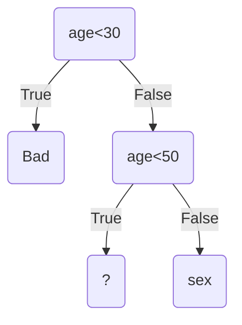

# Intelligent-User-Interface
Intelligent user interface created for the assoviated lecture within LMU. 

## First tutorium

Decisionn tree on the **titanic** dataset:

```mermaid
flowchart TD
    A(age<30)-->|True| B(Bad)
    A(age<30)-->|False| C(age<50)
    C(age<50)-->|True| D(?)
    C(age<50)-->|False| E(sex<male)
```