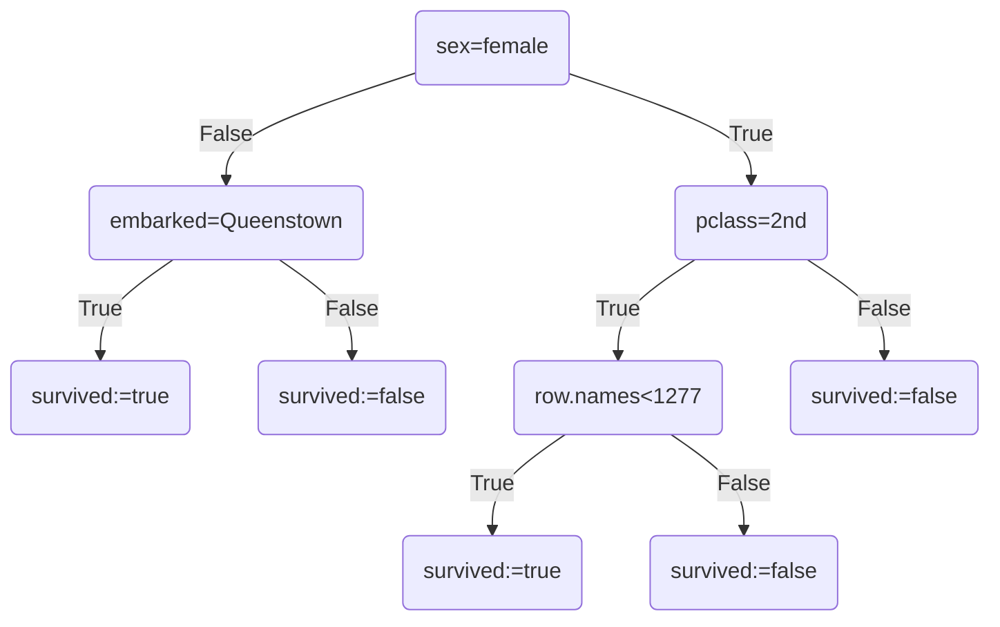

# Tutorium 1

### Table of contents

- [Tutorium 1](#tutorium-1)
    - [Table of contents](#table-of-contents)
    - [Task 1: Decision Trees in Python](#task-1-decision-trees-in-python)
    - [Task 2: Automatic Decision Trees](#task-2-automatic-decision-trees)


### Task 1: Decision Trees in Python

The data includes the **characteristics of each Titanic passenger** (e.g., age, class) and whether or not they **survived the tragedy**.

1. Familiarise yourself with the data set. Count how many people embarked from each city using the .value_counts() command.
```python
df.value_counts("embarked")
```

Output:
```text
embarked
Southampton    174
Cherbourg       58
Queenstown      18
Name: count, dtype: int64
```

2. Create a barplot that shows how many people were in each class ( pclass ). Include the bar chart in your pdf.

```python
df['pclass'].value_counts(ascending=False).plot(kind='bar')
```

Output:


3. Select the first 15 rows and save them as a data frame named df_subset. Copy the resulting table in your submission pdf.

```python
df_subset = df.head(15).copy()
```

Output:
<div>
<style scoped>
    .dataframe tbody tr th:only-of-type {
        vertical-align: middle;
    }

    .dataframe tbody tr th {
        vertical-align: top;
    }

    .dataframe thead th {
        text-align: right;
    }
</style>
<table border="1" class="dataframe">
  <thead>
    <tr style="text-align: right;">
      <th></th>
      <th>row.names</th>
      <th>pclass</th>
      <th>survived</th>
      <th>name</th>
      <th>age</th>
      <th>embarked</th>
      <th>home.dest</th>
      <th>room</th>
      <th>ticket</th>
      <th>boat</th>
      <th>sex</th>
    </tr>
  </thead>
  <tbody>
    <tr>
      <th>703</th>
      <td>704</td>
      <td>3rd</td>
      <td>0</td>
      <td>Cann, Mr Ernest</td>
      <td>21.0</td>
      <td>Southampton</td>
      <td>NaN</td>
      <td>NaN</td>
      <td>NaN</td>
      <td>NaN</td>
      <td>male</td>
    </tr>
    <tr>
      <th>260</th>
      <td>261</td>
      <td>1st</td>
      <td>1</td>
      <td>Taylor, Mrs Elmer Zebley (Juliet Cummins Wright)</td>
      <td>NaN</td>
      <td>Southampton</td>
      <td>London /  East Orange, NJ</td>
      <td>C-126</td>
      <td>NaN</td>
      <td>5</td>
      <td>female</td>
    </tr>
    <tr>
      <th>153</th>
      <td>154</td>
      <td>1st</td>
      <td>0</td>
      <td>Kent, Mr Edward Austin</td>
      <td>58.0</td>
      <td>Cherbourg</td>
      <td>Buffalo, NY</td>
      <td>NaN</td>
      <td>NaN</td>
      <td>(258)</td>
      <td>male</td>
    </tr>
    <tr>
      <th>606</th>
      <td>607</td>
      <td>3rd</td>
      <td>1</td>
      <td>Abelseth, Miss Anna Karen</td>
      <td>16.0</td>
      <td>Southampton</td>
      <td>Norway Los Angeles, CA</td>
      <td>NaN</td>
      <td>NaN</td>
      <td>16</td>
      <td>female</td>
    </tr>
    <tr>
      <th>448</th>
      <td>449</td>
      <td>2nd</td>
      <td>0</td>
      <td>Hold, Mr Stephen</td>
      <td>42.0</td>
      <td>Southampton</td>
      <td>England / Sacramento, CA</td>
      <td>NaN</td>
      <td>NaN</td>
      <td>NaN</td>
      <td>male</td>
    </tr>
    <tr>
      <th>440</th>
      <td>441</td>
      <td>2nd</td>
      <td>0</td>
      <td>Hickman, Mr Lewis</td>
      <td>32.0</td>
      <td>Southampton</td>
      <td>West Hampstead, London / Neepawa, MB</td>
      <td>NaN</td>
      <td>NaN</td>
      <td>NaN</td>
      <td>male</td>
    </tr>
    <tr>
      <th>517</th>
      <td>518</td>
      <td>2nd</td>
      <td>0</td>
      <td>Norman, Mr Robert Douglas</td>
      <td>NaN</td>
      <td>Southampton</td>
      <td>Glasgow</td>
      <td>NaN</td>
      <td>NaN</td>
      <td>(287)</td>
      <td>male</td>
    </tr>
    <tr>
      <th>933</th>
      <td>934</td>
      <td>3rd</td>
      <td>1</td>
      <td>Kink, Miss Louise Gretchen</td>
      <td>NaN</td>
      <td>NaN</td>
      <td>NaN</td>
      <td>NaN</td>
      <td>NaN</td>
      <td>NaN</td>
      <td>female</td>
    </tr>
    <tr>
      <th>1276</th>
      <td>1277</td>
      <td>3rd</td>
      <td>0</td>
      <td>Van Impe, Miss Catharine</td>
      <td>NaN</td>
      <td>NaN</td>
      <td>NaN</td>
      <td>NaN</td>
      <td>NaN</td>
      <td>NaN</td>
      <td>female</td>
    </tr>
    <tr>
      <th>487</th>
      <td>488</td>
      <td>2nd</td>
      <td>0</td>
      <td>Mack, Mrs Mary</td>
      <td>57.0</td>
      <td>Southampton</td>
      <td>Southampton / New York, NY</td>
      <td>E77</td>
      <td>NaN</td>
      <td>(52)</td>
      <td>female</td>
    </tr>
    <tr>
      <th>692</th>
      <td>693</td>
      <td>3rd</td>
      <td>1</td>
      <td>Buckley, Mr Daniel</td>
      <td>21.0</td>
      <td>Queenstown</td>
      <td>Kingwilliamstown, Co Cork, Ireland New York, NY</td>
      <td>NaN</td>
      <td>NaN</td>
      <td>NaN</td>
      <td>male</td>
    </tr>
    <tr>
      <th>186</th>
      <td>187</td>
      <td>1st</td>
      <td>0</td>
      <td>Natsch, Mr Charles H.</td>
      <td>36.0</td>
      <td>Cherbourg</td>
      <td>Brooklyn, NY</td>
      <td>NaN</td>
      <td>NaN</td>
      <td>NaN</td>
      <td>male</td>
    </tr>
    <tr>
      <th>899</th>
      <td>900</td>
      <td>3rd</td>
      <td>0</td>
      <td>Johnston, Mrs Andrew G.</td>
      <td>NaN</td>
      <td>NaN</td>
      <td>NaN</td>
      <td>NaN</td>
      <td>NaN</td>
      <td>NaN</td>
      <td>female</td>
    </tr>
    <tr>
      <th>576</th>
      <td>577</td>
      <td>2nd</td>
      <td>0</td>
      <td>Ware, Mr William J.</td>
      <td>23.0</td>
      <td>Southampton</td>
      <td>NaN</td>
      <td>NaN</td>
      <td>NaN</td>
      <td>NaN</td>
      <td>male</td>
    </tr>
    <tr>
      <th>6</th>
      <td>7</td>
      <td>1st</td>
      <td>1</td>
      <td>Andrews, Miss Kornelia Theodosia</td>
      <td>63.0</td>
      <td>Southampton</td>
      <td>Hudson, NY</td>
      <td>D-7</td>
      <td>13502 L77</td>
      <td>10</td>
      <td>female</td>
    </tr>
  </tbody>
</table>
</div>

4. Draw a decision tree for df_subset using pclass, age, embarked, home.dest, and sex as features, and survived as the target variable.



5. Next, implement your decision tree in Python and apply the decision tree to the complete data set.

```python
def survival_decision_tree(row):
    if (row["sex"] == "female"\
            and row["pclass"] != "2nd"\
            and row["row.names"] < 1277)\
            or (row["sex"] == "male"\
            and row["embarked"] == "Queenstown"):
        return True
    else:
        return False

# apply decision tree function to subset
df_subset['predicted_survival'] = df_subset.apply(survival_decision_tree, axis=1)
df_subset[df_subset["predicted_survival"] == True]
```

Output:
<div>
<style scoped>
    .dataframe tbody tr th:only-of-type {
        vertical-align: middle;
    }

    .dataframe tbody tr th {
        vertical-align: top;
    }

    .dataframe thead th {
        text-align: right;
    }
</style>
<table border="1" class="dataframe">
  <thead>
    <tr style="text-align: right;">
      <th></th>
      <th>row.names</th>
      <th>pclass</th>
      <th>survived</th>
      <th>name</th>
      <th>age</th>
      <th>embarked</th>
      <th>home.dest</th>
      <th>room</th>
      <th>ticket</th>
      <th>boat</th>
      <th>sex</th>
      <th>predicted_survival</th>
    </tr>
  </thead>
  <tbody>
    <tr>
      <th>260</th>
      <td>261</td>
      <td>1st</td>
      <td>1</td>
      <td>Taylor, Mrs Elmer Zebley (Juliet Cummins Wright)</td>
      <td>NaN</td>
      <td>Southampton</td>
      <td>London /  East Orange, NJ</td>
      <td>C-126</td>
      <td>NaN</td>
      <td>5</td>
      <td>female</td>
      <td>True</td>
    </tr>
    <tr>
      <th>606</th>
      <td>607</td>
      <td>3rd</td>
      <td>1</td>
      <td>Abelseth, Miss Anna Karen</td>
      <td>16.0</td>
      <td>Southampton</td>
      <td>Norway Los Angeles, CA</td>
      <td>NaN</td>
      <td>NaN</td>
      <td>16</td>
      <td>female</td>
      <td>True</td>
    </tr>
    <tr>
      <th>933</th>
      <td>934</td>
      <td>3rd</td>
      <td>1</td>
      <td>Kink, Miss Louise Gretchen</td>
      <td>NaN</td>
      <td>NaN</td>
      <td>NaN</td>
      <td>NaN</td>
      <td>NaN</td>
      <td>NaN</td>
      <td>female</td>
      <td>True</td>
    </tr>
    <tr>
      <th>692</th>
      <td>693</td>
      <td>3rd</td>
      <td>1</td>
      <td>Buckley, Mr Daniel</td>
      <td>21.0</td>
      <td>Queenstown</td>
      <td>Kingwilliamstown, Co Cork, Ireland New York, NY</td>
      <td>NaN</td>
      <td>NaN</td>
      <td>NaN</td>
      <td>male</td>
      <td>True</td>
    </tr>
    <tr>
      <th>899</th>
      <td>900</td>
      <td>3rd</td>
      <td>0</td>
      <td>Johnston, Mrs Andrew G.</td>
      <td>NaN</td>
      <td>NaN</td>
      <td>NaN</td>
      <td>NaN</td>
      <td>NaN</td>
      <td>NaN</td>
      <td>female</td>
      <td>True</td>
    </tr>
    <tr>
      <th>6</th>
      <td>7</td>
      <td>1st</td>
      <td>1</td>
      <td>Andrews, Miss Kornelia Theodosia</td>
      <td>63.0</td>
      <td>Southampton</td>
      <td>Hudson, NY</td>
      <td>D-7</td>
      <td>13502 L77</td>
      <td>10</td>
      <td>female</td>
      <td>True</td>
    </tr>
  </tbody>
</table>
</div>

6. Generate a confusion matrix to compare the predictions based on your decision tree with the actual survival data. A confusion matrix shows the number of true positives, true negatives, false positives, and false negatives. You may read more about what a confusion matrix is here: https://towardsdatascience.com/understanding-confusion-matrix-a9ad42dcfd62. Please use sklearn to implement the confusion matrix. The following page shows an example: https://scikit-learn.og/stable/modules/generated/sklearn.metrics.confusion_matrix.html

```python
actual = df["survived"]
predicted = df["predicted_survival"]
plt.figure(figsize=(8, 6))
sb.heatmap(cm(actual, predicted),
            annot=True,
            fmt="d",
            cmap="Blues",
            xticklabels=["!Survived", "Survived"],
            yticklabels=["!Survived", "Survived"])
plt.xlabel('Predicted')
plt.ylabel('Actual')
plt.title('Confusion Matrix')
plt.show()
```

Output:
Here's the confusion matrix of our manually created decision tree:


7. Why might your decision tree not correctly classify all new data points? Is this a problem of over- or under-fitting?

Limited data and complex relationships as well as overfitting are reason that might lead to the poor result of our heuristic approach.

**Is this a problem of over- or under-fitting?**
Our decision tree is clearly overfitting as 101 results were misclassified as the on the whole dataset (df) but only 1 in the original training batch (df_subset).
- One example of overfitting is that the condition accurately represent the training data (df_subset) but does not work accurately on the whole dataset (df).
- One example of underfitting would be that the condition does not accurately represent the training data (df_subset) and would perform approximately the same way on the whole dataset (df).

8. Neural networks often achieve better accuracy than machine learning approaches based on decision trees, such as SVMs. Nonetheless, decision-tree-based machine learning approaches are most widely used. What do you think are the advantages of these approaches? In particular, think about the creditworthiness data set we used in the tutorial.

Decision trees such as support vectors machine (SVMs), offer interpretability, efficiency, robustness, and ease of use for creditworthiness analysis, but may lack neural networks' accuracy and efficiency. Also, SVMs are pretty computationnaly expensive compared to good neural network approaches.

### Task 2: Automatic Decision Trees

You can use the library sklearn to calculate a decision tree automatically. Calculate an automatic decision tree for the Titanic data set and visualize the tree using graphviz and pydotplus.

```python
le = LabelEncoder()
df_copy = df_copy.apply(le.fit_transform)

# X -> predictions
# y -> labels (targets)
X = df_copy.drop(columns=["survived"])
y = df_copy["survived"]

clf = DecisionTreeClassifier()
clf.fit(X, y)

dot_data = export_graphviz(
    clf, out_file=None,
    feature_names=X.columns,
    class_names=['!Survived',
    'Survived'],
    filled=True,
    rounded=True,
    special_characters=True
    )
graph = pydotplus.graph_from_dot_data(dot_data)
graph.write_png('mydecisiontree.png')
```

Output:


**Just for testing purposes:**

This time we regenerated the cm but with the same training and validation dataset. As we can see the Decision Tree Classifier clearly **overfit** our data as this one would not perform the same way on new unseen data. It has a 100% accuracy because the decision tree was created to completely use all the features available for classifying the outcome.

```python
# Just for testing purposes

new_predictions = clf.predict(X)

plt.figure(figsize=(8, 6))
sb.heatmap(cm(y, new_predictions),
            annot=True,
            fmt="d",
            cmap="Blues",
            xticklabels=["!Survived", "Survived"],
            yticklabels=["!Survived", "Survived"])
plt.xlabel('Predicted')
plt.ylabel('Actual')
plt.title('Confusion Matrix')
plt.show()
```

Output:
